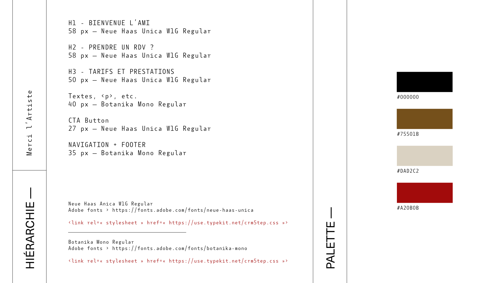
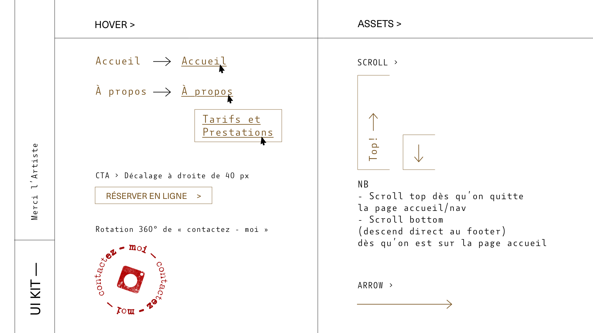

# Merci L'Artiste Project

Barber Shop website with external appointment scheduler made with React.js

## Available Scripts

To render project, just launch

### `yarn && yarn start`

Runs the app in the development mode.\
Open [http://localhost:3006](http://localhost:3006) to view it in your browser.

The page will reload when you make changes.\
You may also see any lint errors in the console.

## Assets

### Mockup (Subject to change)

